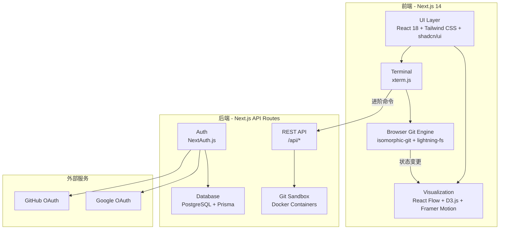
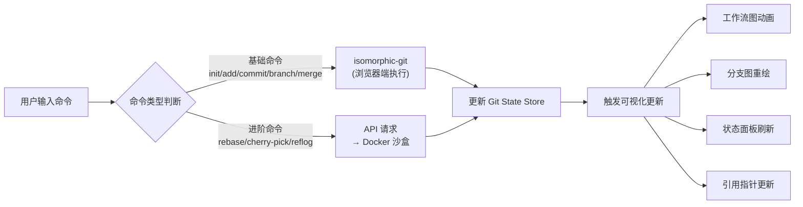

# OpenGit — 全局计划落地方案

<aside>
🎯

**OpenGit** — 一个开源的交互式 Git & GitHub 可视化学习平台，面向计算机专业学生，让你通过动态操作和实时可视化真正理解 Git。

</aside>

## 项目概述

**项目名称**：OpenGit

**开源协议**：MIT

**技术栈**：Next.js 14 (App Router) + React 18 + TypeScript

**目标用户**：计算机专业学生、编程初学者、Git 新手

**核心理念**：不做纸上谈兵，每一个概念都有对应的动态可视化和可操作的模拟环境

---

## 一、核心功能模块

### 1. 交互式模拟终端 🖥️

<aside>
💡

使用 **xterm.js** 构建浏览器内终端，支持命令输入、自动补全、历史记录

</aside>

- 支持所有常用 git 命令的模拟执行
- 输入命令后实时更新右侧可视化面板
- **智能错误提示**：输错命令时，系统不会主动教学，而是像真实终端一样报错，同时在错误信息下方给出「为什么报错」和「正确做法」的提示卡片
- 支持 Tab 自动补全 git 命令和参数
- 命令历史记录（↑/↓ 键翻阅）

**技术实现**：

| 层级 | 技术选型 | 职责 |
| --- | --- | --- |
| 终端 UI | xterm.js + xterm-addon-fit | 浏览器内终端渲染、输入输出 |
| 命令解析 | 自研 Parser | 解析 git 命令参数，路由到对应处理器 |
| 前端 Git 引擎 | isomorphic-git + lightning-fs | 浏览器端执行基础 git 操作（init/add/commit/branch/merge 等） |
| 后端 Git 沙盒 | Docker + real git | 进阶命令（rebase/cherry-pick/reflog 等）通过 API 调用后端真实 git |

### 2. 实时可视化引擎 📊

网站的核心竞争力——四种可视化视图同步联动：

#### 视图 A：Git 工作流程图（动态交互版）

基于你发的那张经典图的**动态升级版**：

- 四个区域：**工作目录 → 暂存区 → 本地仓库 → 远程仓库**（+ Stash 区 + Worktree 区）
- 输入 `git add` 时，文件图标从「工作目录」动画飞到「暂存区」
- 输入 `git commit` 时，文件从「暂存区」打包飞到「本地仓库」
- 输入 `git push` 时，数据包从「本地仓库」飞到「远程仓库」
- 每个区域显示当前包含的文件列表和状态
- **点击任意区域**可展开详细信息

**技术选型**：React Flow + Framer Motion（动画）

#### 视图 B：Git Graph 分支图（IDE 风格）

还原 VS Code Git Graph 插件的效果：

- 彩色分支线条，每个 commit 是一个节点
- 显示 commit hash（短）、commit message、作者、时间
- 分支标签（main、feature/xxx）、远程标签（origin/main）
- **合并线**清晰展示 merge 和 rebase 的区别
- 悬浮某个 commit 显示详细 diff
- **重点标注**：用不同颜色和图标区分 HEAD、main、origin/main、feature 分支

**技术选型**：D3.js 自定义绘制 / React Flow

#### 视图 C：仓库状态面板

类似 `git status` 的可视化增强版：

- 文件树形结构展示
- 每个文件用颜色标记状态：🟢 已跟踪 🟡 已修改 🔴 未跟踪 🟣 已暂存
- 显示当前 HEAD 指向、当前分支、暂存区内容
- 显示 local 和 remote 的 commit 差异（ahead/behind 计数）

#### 视图 D：引用指针图

解决你"看不懂 main 和 origin/main 区别"的痛点：

- 可视化展示所有引用（refs）指向哪个 commit
- HEAD → main → commit-abc123
- origin/main → commit-def456
- 每次操作后，箭头指向实时更新
- 用动画展示 fast-forward、分叉、合并等场景下指针的移动

### 3. 真实项目模拟场景 🏗️

不是闯关，而是模拟真实开发流程：

**场景一：从零开始个人项目**

- 初始化仓库 → 写代码 → 提交 → 推送到 GitHub → 日常开发循环

**场景二：加入团队项目**

- Clone 仓库 → 创建 feature 分支 → 开发 → PR → Code Review → 合并

**场景三：处理冲突**

- 两人同时修改同一文件 → pull 时冲突 → 手动解决 → 提交

**场景四：版本回退与修复**

- 提交了 bug → reset/revert → 修复后重新提交

**场景五：发布管理**

- Git Flow / GitHub Flow → Tag → Release

**场景六：Worktree 多分支并行开发**

- 正在 feature 分支开发 → 突然要修 hotfix → 用 worktree 创建独立工作目录 → 同时处理两个分支 → 修完合并回来

每个场景提供：

- 预设好的仓库初始状态
- 操作指引（不是手把手教，而是告诉你目标，让你自己操作）
- 操作完成后的验证（对比期望状态）

### 4. 命令参考文档 📖

独立页面，不和可视化混在一起：

- **按分类组织**：基础 / 分支 / 远程 / 进阶 / 撤销 / Worktree
- 每个命令包含：语法、参数说明、使用场景、常见搭配、注意事项
- 搜索功能：快速查找命令
- 每个命令旁边有「在终端试试」按钮，跳转到模拟终端预填命令

### 5. Git Worktree 教学模块 🌳

<aside>
🔑

**git worktree** 允许你从同一个仓库创建多个工作目录，每个目录可以 checkout 不同的分支，互不干扰。

</aside>

**为什么需要 Worktree？**

- 你正在 `feature/payment` 分支写代码写到一半，老板说线上有 bug 要紧急修
- **没有 worktree 的做法**：`git stash` → `git checkout main` → 修 bug → `git checkout feature/payment` → `git stash pop`（容易搞混，stash 多了更混乱）
- **有 worktree 的做法**：`git worktree add ../hotfix main` → 在新目录修 bug → 修完合并 → `git worktree remove ../hotfix`（原来的工作目录完全不受影响）

**核心概念可视化**

- `.git` 目录只有一份，多个 worktree 共享同一个仓库
- 每个 worktree 有自己独立的工作目录和暂存区
- 不同 worktree 不能同时 checkout 同一个分支
- `.worktrees` 文件夹是 Git 内部用来追踪额外 worktree 的元数据

**教学内容**

- `git worktree add <path> <branch>` — 创建新的工作目录
- `git worktree list` — 查看所有 worktree
- `git worktree remove <path>` — 删除 worktree
- `git worktree prune` — 清理无效的 worktree 记录
- Worktree vs Stash vs 多个 Clone 的对比
- `.git` 文件（不是文件夹！）在 worktree 子目录中指向主仓库的原理

**Playground 可视化**

- 在视图 A 中新增 Worktree 区域，展示多个工作目录如何共享同一个 `.git` 仓库
- 输入 `git worktree add` 时，动画展示新工作目录从主仓库中「分裂」出来
- 清晰展示每个 worktree 的 HEAD 指向不同分支

### 6. GitHub 教学模块 🐙

**GitHub 入门**

- GitHub 是什么，和 Git 的关系
- 注册、SSH 配置（生成密钥、添加到 GitHub）
- HTTPS vs SSH 连接方式对比
- 个人资料、仓库概览

**GitHub 核心操作**

- 创建仓库 / Fork 仓库 / Clone 仓库
- Pull Request 全流程（创建 → Review → 讨论 → 合并）
- Issues（创建、标签、分配、关闭）
- GitHub Actions（CI/CD 基础概念 + 示例 workflow）
- GitHub Projects（项目管理看板）
- Releases 和 Tags

**GitHub 协作流程**

- Fork + PR 的开源协作模式
- Branch Protection Rules
- Code Review 最佳实践
- `.gitignore`、`README.md`、`LICENSE` 规范

### 6. 用户系统 👤

- **GitHub OAuth 登录**
- **Google OAuth 登录**
- 登录后保存学习进度、终端历史、自定义场景
- 用户 Profile 页面

---

## 二、页面结构设计

```
OpenGit/
├── / (首页/Landing Page)
│   └── 项目介绍 + 功能预览 + 快速开始
├── /playground (核心操作台)
│   ├── 左侧: 模拟终端 (xterm.js)
│   ├── 右上: 可视化面板 (可切换 4 种视图)
│   └── 右下: 文件状态面板
├── /scenarios (场景模拟)
│   ├── /scenarios/solo-project
│   ├── /scenarios/team-collab
│   ├── /scenarios/conflict-resolution
│   ├── /scenarios/version-rollback
│   └── /scenarios/release-management
├── /docs (命令文档)
│   ├── /docs/basics
│   ├── /docs/branching
│   ├── /docs/remote
│   ├── /docs/advanced
│   └── /docs/search
├── /github (GitHub 教学)
│   ├── /github/intro
│   ├── /github/ssh-setup
│   ├── /github/pull-requests
│   ├── /github/issues
│   ├── /github/actions
│   └── /github/collaboration
├── /auth (登录)
│   ├── GitHub OAuth
│   └── Google OAuth
└── /profile (个人中心)
    └── 学习进度 + 终端历史
```

---

## 三、技术架构

### 整体架构图



### 技术选型清单

| 类别 | 技术 | 用途 |
| --- | --- | --- |
| 框架 | Next.js 14 (App Router) | 全栈框架、SSR/SSG、API Routes |
| 语言 | TypeScript | 全栈类型安全 |
| UI 组件 | shadcn/ui + Tailwind CSS | 界面组件、响应式样式 |
| 终端模拟 | xterm.js | 浏览器内终端 |
| 浏览器端 Git | isomorphic-git + lightning-fs | 前端 Git 操作引擎 |
| 可视化 | React Flow + D3.js | 分支图、工作流图 |
| 动画 | Framer Motion | 数据流动动画、状态转换 |
| 认证 | NextAuth.js v5 | GitHub / Google OAuth |
| 数据库 | PostgreSQL + Prisma | 用户数据、学习进度 |
| 沙盒容器 | Docker + dockerode | 后端真实 Git 环境 |
| 状态管理 | Zustand | 全局 Git 状态管理 |
| 国际化 | next-intl | 中英双语支持 |
| 文档内容 | MDX + contentlayer | 命令文档、教学内容 |
| 包管理 | pnpm | 依赖管理 |
| 代码规范 | ESLint + Prettier | 代码风格统一 |

---

## 四、核心数据流设计

### 命令执行流程



### Git 状态模型（Zustand Store）

```tsx
interface GitState {
  // 仓库核心状态
  workingDirectory: FileEntry[]    // 工作目录文件
  stagingArea: FileEntry[]         // 暂存区文件
  commits: Commit[]                // 提交历史
  branches: Branch[]               // 分支列表
  remotes: Remote[]                // 远程仓库
  stash: StashEntry[]              // 暂存栈
  
  // 引用指针
  HEAD: string                     // 当前 HEAD 指向
  refs: Record<string, string>     // 所有引用 → commit 映射
  
  // UI 状态
  activeView: 'workflow' | 'graph' | 'status' | 'refs'
  terminalHistory: TerminalEntry[]
  
  // 操作方法
  executeCommand: (cmd: string) => Promise<CommandResult>
  resetState: () => void
  loadScenario: (id: string) => void
}
```

---

## 五、Playground 页面布局

```
┌──────────────────────────────────────────────────────┐
│  OpenGit Playground          [场景选择 ▾] [重置] [⚙]  │
├────────────────────┬─────────────────────────────────┤
│                    │  ┌─[工作流] [分支图] [状态] [引用]┐│
│                    │  │                               ││
│   模拟终端          │  │     可视化面板                 ││
│   (xterm.js)       │  │     (根据 tab 切换)           ││
│                    │  │                               ││
│   $ git init       │  │   ┌───┐  ┌───┐  ┌───┐  ┌───┐ ││
│   $ git add .      │  │   │工作│→│暂存│→│本地│→│远程│ ││
│   $ git commit     │  │   │目录│  │ 区 │  │仓库│  │仓库│ ││
│   $ _              │  │   └───┘  └───┘  └───┘  └───┘ ││
│                    │  │                               ││
│                    │  └───────────────────────────────┘│
│                    ├─────────────────────────────────┤
│                    │  文件状态面板                     │
│                    │  📄 index.html  🟢 tracked       │
│                    │  📄 style.css   🟡 modified      │
│                    │  📄 app.js      🔴 untracked     │
├────────────────────┴─────────────────────────────────┤
│  💡 提示: git add 将文件从工作目录添加到暂存区         │
└──────────────────────────────────────────────────────┘
```

---

## 六、isomorphic-git 支持的命令映射

| 命令 | isomorphic-git 支持 | 执行位置 |
| --- | --- | --- |
| git init | ✅ | 浏览器 |
| git add | ✅ | 浏览器 |
| git commit | ✅ | 浏览器 |
| git branch | ✅ | 浏览器 |
| git checkout / switch | ✅ | 浏览器 |
| git merge | ✅ | 浏览器 |
| git clone | ✅ | 浏览器 |
| git push / pull / fetch | ✅ | 浏览器（模拟远程） |
| git log / status / diff | ✅ | 浏览器 |
| git stash | ❌ | Docker 沙盒 |
| git rebase | ❌ | Docker 沙盒 |
| git cherry-pick | ❌ | Docker 沙盒 |
| git reset | 部分 ✅ | 混合 |
| git revert | ❌ | Docker 沙盒 |
| git reflog | ❌ | Docker 沙盒 |
| git tag | ✅ | 浏览器 |
| git remote | ✅ | 浏览器 |

---

## 七、数据库设计

```tsx
// Prisma Schema 核心模型

model User {
  id            String    @id @default(cuid())
  name          String?
  email         String?   @unique
  image         String?
  provider      String    // github | google
  providerId    String
  progress      Progress[]
  sessions      Session[]
  createdAt     DateTime  @default(now())
}

model Progress {
  id            String    @id @default(cuid())
  userId        String
  user          User      @relation(fields: [userId])
  scenarioId    String
  status        String    // not_started | in_progress | completed
  terminalLog   Json?     // 保存终端操作历史
  gitState      Json?     // 保存 Git 状态快照
  updatedAt     DateTime  @updatedAt
}

model Session {
  id            String    @id @default(cuid())
  userId        String
  user          User      @relation(fields: [userId])
  expiresAt     DateTime
}
```

---

## 八、开发路线图

### Phase 1：基础框架搭建（Week 1-2）

- [ ]  初始化 Next.js 14 项目 + TypeScript + Tailwind + shadcn/ui
- [ ]  配置 pnpm + ESLint + Prettier + Husky
- [ ]  搭建项目目录结构
- [ ]  配置 next-intl 国际化（中/英）
- [ ]  实现 Landing Page 首页
- [ ]  集成 NextAuth.js（GitHub + Google OAuth）
- [ ]  配置 PostgreSQL + Prisma + 数据库迁移

### Phase 2：核心终端 + 浏览器 Git 引擎（Week 3-4）

- [ ]  集成 xterm.js 终端组件
- [ ]  集成 isomorphic-git + lightning-fs
- [ ]  实现命令解析器（Parser）
- [ ]  实现基础命令处理器：init / add / commit / status / log
- [ ]  实现分支命令：branch / checkout / switch / merge
- [ ]  实现远程模拟：remote / push / pull / fetch / clone
- [ ]  实现 Git 状态 Zustand Store
- [ ]  终端命令自动补全

### Phase 3：可视化引擎（Week 5-7）

- [ ]  视图 A — 工作流程图（React Flow + Framer Motion 动画）
- [ ]  视图 B — Git Graph 分支图（D3.js 自定义绘制）
- [ ]  视图 C — 仓库状态面板（文件树 + 状态标记）
- [ ]  视图 D — 引用指针图（HEAD / branch / remote 指针可视化）
- [ ]  可视化与终端的实时联动
- [ ]  Playground 整体布局和响应式适配

### Phase 4：Docker 沙盒 + 进阶命令（Week 8-9）

- [ ]  搭建 Docker 沙盒服务（dockerode）
- [ ]  实现沙盒 API（创建/销毁/执行命令）
- [ ]  实现进阶命令：rebase / cherry-pick / stash / revert / reflog / worktree
- [ ]  沙盒命令结果同步到前端可视化
- [ ]  沙盒资源管理（超时回收、并发限制）

### Phase 5：场景系统 + 文档（Week 10-11）

- [ ]  设计场景数据结构（初始状态 + 目标状态 + 验证逻辑）
- [ ]  实现 6 个核心场景（含 worktree 场景）
- [ ]  场景选择页面 + 场景加载逻辑
- [ ]  命令参考文档页面（MDX 内容）
- [ ]  文档搜索功能
- [ ]  「在终端试试」跳转功能

### Phase 6：GitHub 教学模块（Week 12-13）

- [ ]  GitHub 介绍页面
- [ ]  SSH 配置教学（交互式步骤指引）
- [ ]  HTTPS vs SSH 对比可视化
- [ ]  Pull Request 流程可视化
- [ ]  Issues / Actions / Projects / Releases 教学页面
- [ ]  开源协作流程教学

### Phase 7：用户系统 + 部署（Week 14-15）

- [ ]  学习进度保存与恢复
- [ ]  用户 Profile 页面
- [ ]  终端历史保存
- [ ]  部署到自有服务器（Docker Compose）
- [ ]  CI/CD 配置
- [ ]  README + 贡献指南 + LICENSE

---

## 九、项目目录结构

```
open-git/
├── public/
│   └── locales/           # 国际化资源
│       ├── zh/
│       └── en/
├── prisma/
│   └── schema.prisma      # 数据库 Schema
├── src/
│   ├── app/               # Next.js App Router
│   │   ├── [locale]/      # 国际化路由
│   │   │   ├── page.tsx           # Landing Page
│   │   │   ├── playground/        # 核心操作台
│   │   │   ├── scenarios/         # 场景模拟
│   │   │   ├── docs/              # 命令文档
│   │   │   ├── github/            # GitHub 教学
│   │   │   └── profile/           # 个人中心
│   │   └── api/           # API Routes
│   │       ├── auth/              # NextAuth
│   │       └── sandbox/           # Docker 沙盒 API
│   ├── components/        # 组件
│   │   ├── terminal/              # 终端相关
│   │   │   ├── Terminal.tsx
│   │   │   ├── CommandParser.ts
│   │   │   └── AutoComplete.ts
│   │   ├── visualizations/        # 可视化相关
│   │   │   ├── WorkflowDiagram.tsx
│   │   │   ├── GitGraph.tsx
│   │   │   ├── StatusPanel.tsx
│   │   │   └── RefsPointer.tsx
│   │   ├── ui/                    # shadcn/ui 组件
│   │   └── layout/                # 布局组件
│   ├── lib/               # 核心库
│   │   ├── git-engine/            # Git 引擎封装
│   │   │   ├── browser-git.ts     # isomorphic-git 封装
│   │   │   ├── commands/          # 命令处理器
│   │   │   └── sandbox-client.ts  # Docker 沙盒客户端
│   │   ├── store/                 # Zustand 状态
│   │   │   └── git-store.ts
│   │   └── scenarios/             # 场景定义
│   ├── content/           # MDX 文档内容
│   │   ├── docs/
│   │   └── github/
│   └── styles/            # 全局样式
├── docker/
│   ├── sandbox/
│   │   └── Dockerfile     # Git 沙盒镜像
│   └── docker-compose.yml
├── next.config.js
├── tailwind.config.ts
├── tsconfig.json
└── package.json
```

---

## 十、关键设计决策

| 决策点 | 选择 | 原因 |
| --- | --- | --- |
| Git 引擎 | 混合方案 | isomorphic-git 覆盖 80% 命令零延迟，Docker 补充进阶命令保证真实性 |
| 远程仓库模拟 | 浏览器内虚拟远程 | 用 lightning-fs 创建第二个 git 仓库模拟 remote，无需真实服务器 |
| 分支图渲染 | D3.js 自定义 | 需要精确控制 VS Code 风格的线条绘制和交互，React Flow 不够灵活 |
| 工作流动画 | React Flow + Framer Motion | React Flow 处理节点布局，Framer Motion 处理数据流动效果 |
| 教学内容格式 | MDX | Markdown 写文档 + 嵌入 React 交互组件，作为开源项目方便社区贡献 |
| 数据库 | PostgreSQL | 你服务器上应该已有，Prisma 生态成熟 |

---

## 十一、部署方案

```yaml
# docker-compose.yml
version: '3.8'
services:
  app:
    build: .
    ports:
      - '3000:3000'
    environment:
      - DATABASE_URL=postgresql://user:pass@db:5432/opengit
      - NEXTAUTH_SECRET=xxx
      - GITHUB_CLIENT_ID=xxx
      - GITHUB_CLIENT_SECRET=xxx
      - GOOGLE_CLIENT_ID=xxx
      - GOOGLE_CLIENT_SECRET=xxx
    depends_on:
      - db
      - sandbox

  db:
    image: postgres:16
    volumes:
      - pgdata:/var/lib/postgresql/data
    environment:
      POSTGRES_DB: opengit
      POSTGRES_USER: user
      POSTGRES_PASSWORD: pass

  sandbox:
    build: ./docker/sandbox
    privileged: true
    volumes:
      - /var/run/docker.sock:/var/run/docker.sock

volumes:
  pgdata:
```

---

## 十二、开发前准备清单

- [ ]  Node.js 18+ 和 pnpm 安装
- [ ]  PostgreSQL 数据库准备
- [ ]  Docker Desktop 安装（用于本地沙盒开发）
- [ ]  GitHub OAuth App 创建（Settings → Developer settings → OAuth Apps）
- [ ]  Google Cloud Console 创建 OAuth 2.0 客户端
- [ ]  域名准备（部署时需要，本地开发可用 [localhost](http://localhost)）